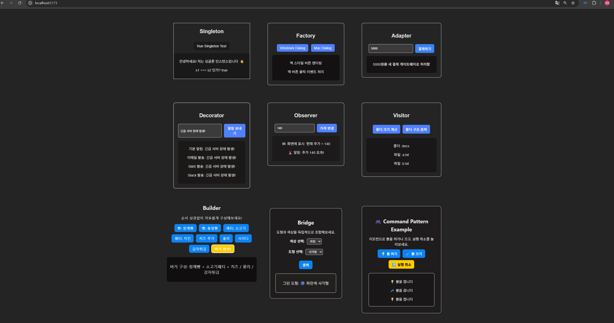

# 🎨 객체지향 디자인 패턴 실습

> Vue + TypeScript 기반 디자인 패턴 구현 과제

---

## 📘 구현한 디자인 패턴

### 🧱 생성(Creational)
- Singleton (싱글톤)
- Factory Method (팩토리 메서드)
- Builder (빌더)

### 🧩 구조(Structural)
- Adapter (어댑터)
- Decorator (데코레이터)
- Bridge (브리지)

### 🔁 행위(Behavioral)
- Observer (옵저버)
- Visitor (비지터)
- Command (커맨드)

---
## 🌐 배포 링크
https://rinda1234.pattern

---
## 🖼 실행 화면

